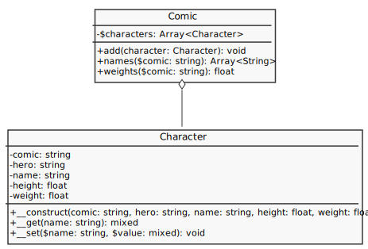

# Quadrinhos

Crie uma coleção de personagens (`Character`) em um quadrinho (`Comic`) seguindo esta representação:

No quadrinho será possível determinar quais são os personagens de uma empresa específica, por exemplo, se os quadrinhos possuírem os personagens: Batman, Hulk, Spider-Man e Superman, e for solicitado personagens da Marvel ou DC, será exibido apenas os personagens específicados.

Também será listado os pesos dos personagens por empresa específica.