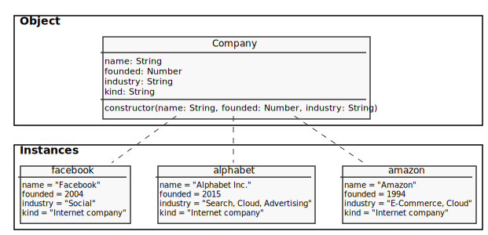
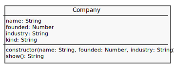
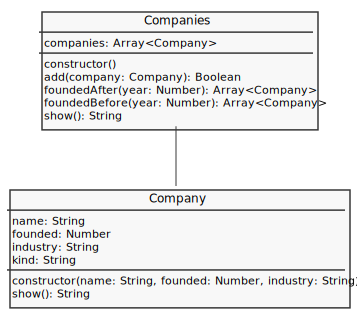

# Coleção de Empresas

Crie uma variável que contenha as informações desta tabela:

| Name          | Founded | Industry                   | Kind             |
| ------------- | ------- | -------------------------- | ---------------- |
| Amazon        | 1994    | E-Commerce, Cloud          | Internet company |
| Facebook      | 2004    | Social                     | Internet company |
| Alphabet Inc. | 2015    | Search, Cloud, Advertising | Internet company |

Uma das formas de estruturação desta tabela pode ser por meio da classe do diagrama a seguir:



Portanto, crie a classe Company conforme o diagrama a seguir:



Contudo, o resultado do método `show()` deve ser o nome e ano de fundação da empresa (sempre com tamanho de 15 caracteres):

```
Name.........Founded
```

Crie também a classe `Companies` para agrupar uma coleção de `Company`:



O método `show()` da coleção deve evocar todos os `show()` de suas instâncias:

```
Amazon.........1994
Alphabet Inc...2015
Facebook.......2004
```
