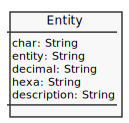

# Entity

Estruture a informação desta coleção de Entidades do HTML com algum tipo de dados, talvez usando objeto:

| Char | Entity   | Decimal  | Hexa     | Description    |
| ---- | -------- | -------- | -------- | -------------- |
| &    | `&amp;`  | `&#38;`  | `&#x26;` | ampersand      |
| <    | `&lt;`   | `&#60;`  | `&#x3C;` | less than      |
| >    | `&gt;`   | `&#62;`  | `&#x3E;` | greater than   |
| ©    | `&copy;` | `&#169;` | `&#xA9;` | copyright sign |

Para facilitar o processo, observe este diagrama:

