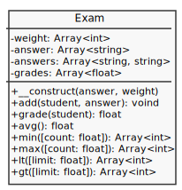

# Exame OO

Considere que um professor está construindo um sistema de avaliações no qual as questões possuem peso, então dado que foi criado uma avaliação com estas questões:

| Questões | Peso | Resposta |
| -------- | ---- | -------- |
| 1        | 2    | a        |
| 2        | 2    | b        |
| 3        | 2    | a        |
| 4        | 2    | c        |
| 5        | 2    | d        |

Então se um aluno respondeu a prova com as seguintes alternativas o resultado da nota será 4,0.

| Questões | Peso | Resposta | Aluno   |
| -------- | ---- | -------- | ------- |
| 1        | 2    | a        | a       |
| 2        | 2    | b        | b       |
| 3        | 2    | a        | b       |
| 4        | 2    | c        | b       |
| 5        | 2    | d        | b       |

Para facilitar a criação deste sistema tente criar a classe `Exam` com esta estrutura:

