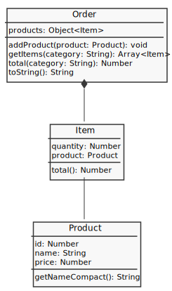

# Compras por Categorias (OO)

Crie um sistema de compras baseado neste diagrama:

Para testar o método `total()` de `Order` use este cenário de produtos:

| ID  | Produto | Preço |
| --- | ------- | ----- |
| 1   | Lápis   | 1,50  |
| 2   | Caneta  | 3,00  |
| 3   | Caderno | 20,00 |

Para adicionar os produtos em `Order` utilize o método `addProduct()`. Então, ao adicionar 2 Lápis, 1 caderno e 1 caneta o resultado de `total()` deve ser R\$ 26,00.