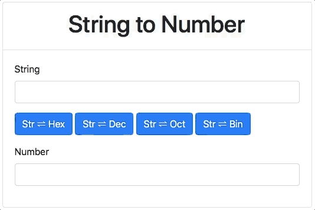

# String to Number

## Description
---

```js
const base = 16
const char = 'A'
const result = char.charCodeAt().toString(base).padStart(base, '0')
console.log(result) //=> 41
```

```js
const base = 10
const number = 65
const result = String.fromCharCode(parseInt(number, base))
console.log(result) //=> 'A'
```

## Interface
---

Code: [code.zip](code.zip)



> [Response alternative](code-response/)