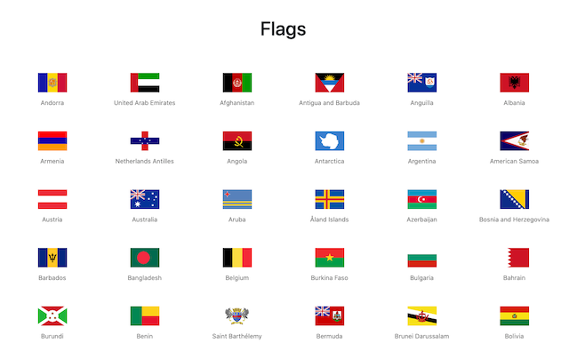

# Bandeiras dos Países

Crie um aplicativo que exiba as bandeiras dos países baseado nos dados da API [Country Flags](https://www.countryflags.io/). O resultado final deve ser semelhante ao da _Figura 1_.

_Figura 1: Página das Bandeiras_ 

