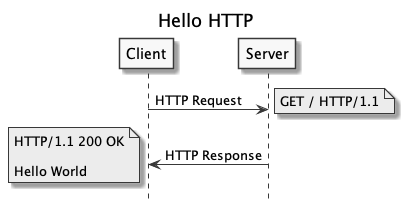

# Hello World

Crie um algoritmo que exiba uma saudação por meio de um resposta HTTP. Então, ao requisitar a página raiz `/` a reposta deve ser `Hello World`.

Para compreender melhor o fluxo veja a _Figura 1_.

_Figura 1: Hello HTTP_

