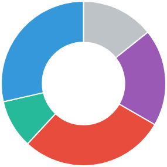

# Chart JS (Doughnut)

## Tips
---

[chart.js](http://www.chartjs.org) data:

```js
let data = {
  labels: ["Symbian", "Blackberry", "Other", "Android", "IOS"],
  datasets: [{
    data: [15, 20, 30, 10, 30],
    backgroundColor: ["#BDC3C7", "#9B59B6", "#E74C3C", "#26B99A", "#3498DB"],
    hoverBackgroundColor: ["#CFD4D8", "#B370CF", "#E95E4F", "#36CAAB", "#49A9EA"]
  }]
}
```

## Interface
---

[site](http://www.chartjs.org)


> [Alternativa de resposta](code-response/)